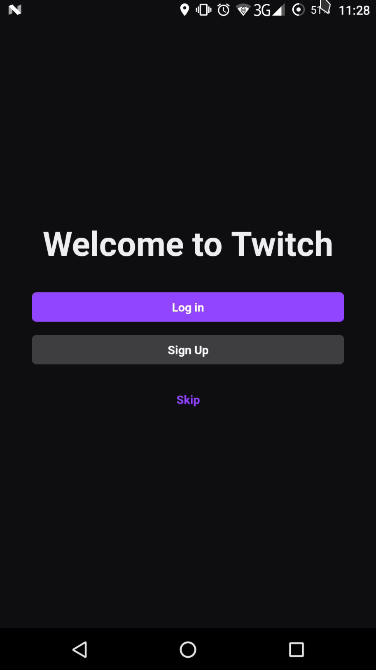
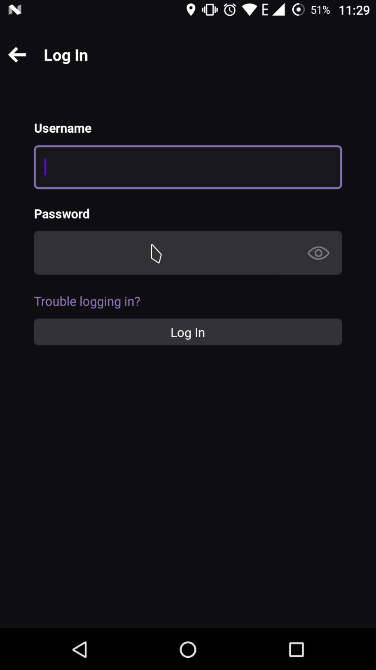
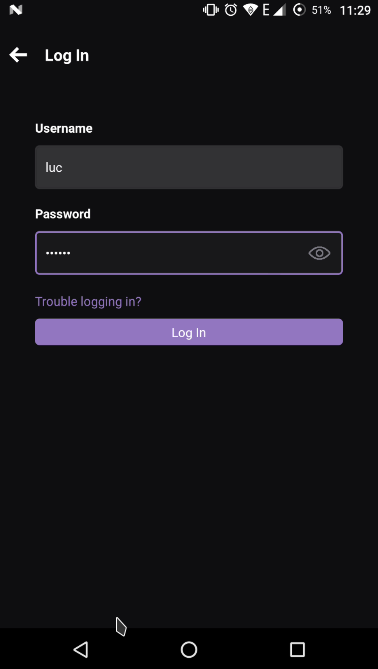
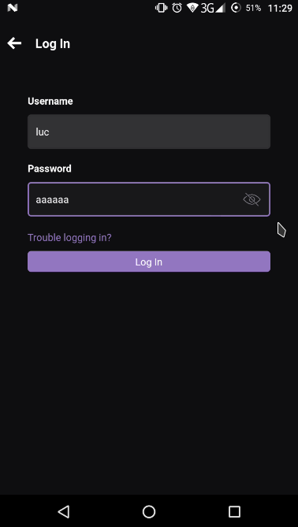
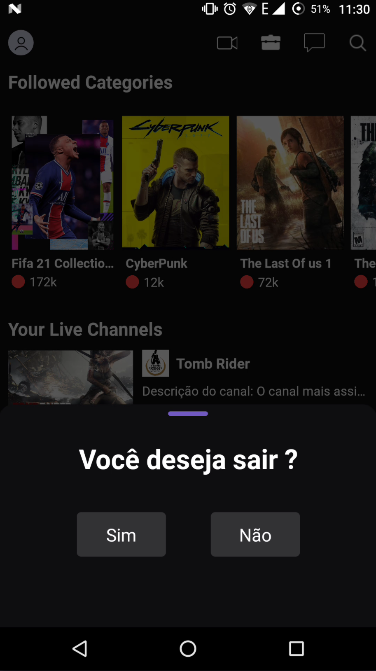

# CloneTwitchCss
Projeto realizado para a matéria de react native do Serratec

# Passo a passo

Na pasta no projeto, rode o comando:

``npm-install``

e depois:

`npm start`

# Algumas funcionalidades 

## Na tela de welcome

Só o botão de login funciona,

## Na pagina de login

Os botoes de voltar e de login funcionam (o de login precisa de uma senha para funcionar), no campo password o botao de visivel funciona.

## Na pagina principal 

O botão de perfil abre um modal para voltar a tela de boas vindas.

# Algumas ScreensShots do projeto

